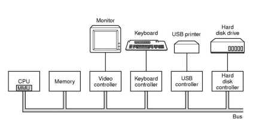
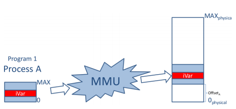
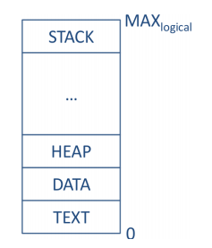
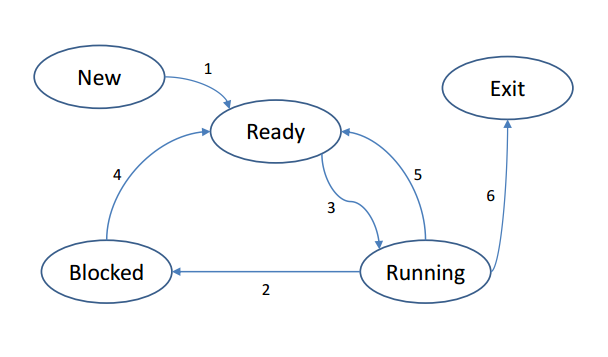
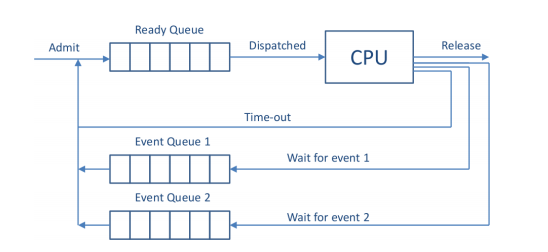
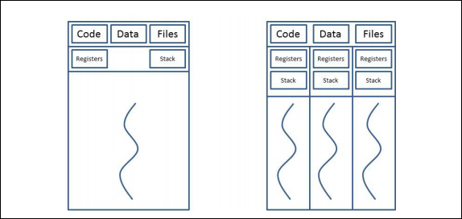
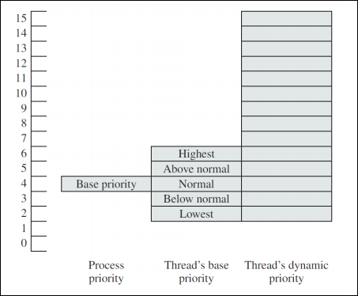
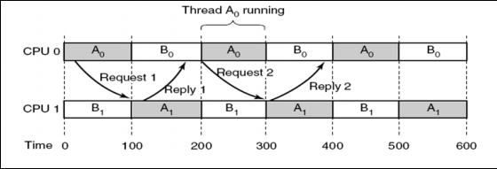

# Operating Systems and Concurrency

## [Lecture 1 introduction](http://moodle.nottingham.ac.uk/pluginfile.php/2720824/course/section/705997/introduction1%20%281%29.pdf)
Module goals:

- Introduce the fundamental concepts and principles of an Operating System and Concurrency.
- Help to understand how programs rely on the OS.
- Understand the basic writing of concurrent(also known as parallel) code.

What you should know by now(Labs):

- Fundamentals of OS concepts
- How to use operating system APIs and how OS schedulers work(HUGE CW we had)
- Concurrency

### The exam
- It will be 120 minutes focused on:
	- Knowledge
	- Understanding
	- Application
- The exam will be 3 of 4 questions accounting for 75% of the module
- Sample questions and exams are on moodle

#### Past exams(links)
- [Exam 2009-2010](http://moodle.nottingham.ac.uk/mod/resource/view.php?id=2071747)
- [Exam 2010-2011](http://moodle.nottingham.ac.uk/mod/resource/view.php?id=2071748)
- [Exam 2011-2012](http://moodle.nottingham.ac.uk/mod/resource/view.php?id=2071749)
- [Exam 2012-2013](http://moodle.nottingham.ac.uk/mod/resource/view.php?id=2071750)

### Module content
>*This table is confusing but he gave it out like that*

|Subject | Lectures | Lecturer|
|--------|----------|---------|
|Introduction to OS|1-2|GDM|
|Processes, Thread|3-4|GDM|
|Concurrency and Deadlocks|5-6|GDM|
|Memory management,Swapping and virtual memory|4-5|IT|
|File Systems|3-4|IT|
|Visualization|1|IT|
|Revision|2|IT|

### Definitions
You should know these by now but let me refresh your memory

- File Systems: Physical location of a file(on disk)
- Abstraction: Covering up complex process with nice high level functions and methods
- Concurrency: Allowing programs to run at the same time(without them causing conflicts)
- Security: I can't be bothered to explain this one come on guys

### When an OS comes in handy?
An OS is basically a massive layer of abstraction between code and the actual Hardware and this comes in handy on a series of occasions because as programmers we can forget about hardware limitations(sometimes) and focus on algorithms.

Examples of OS abstraction:

- OSs will find a way of dealing with data when memory(RAM) is full, of course this won't be super fast and efficient but it will make the program work(this is called Swap memory on some operating systems)
- OSs will optimize the usage of memory when only certain data in an array is needed instead of all of it
- OSs will handle processes so a computer can "Multi task" making you resource intensive program bearable to use while doing other tasks.

For these and many more reasons you love your OS because it allows you to be lazy and not have to worry about the hardware most of the time you write code.

Quote this next line on the exam for some ez marks:

>*“All problems in computer science can be solved by another level of indirection”*
Dr David Wheeler PhD in computer science 1951

### Concurrency
One of the most important features of modern Operating Systems is their implementations of Concurrency. These allow programmers to implements code that will run asynchronously in multiple CPU cores theoretically speeding up your program to up to twice its normal speed. Modern CPUs are what we call multi-core or multi-threaded this means that one single CPU can do multiple operations at the same time, as long of course they don't rely on the result of another core computation.

#### Kernel mode
To achieve concurrency and what is called Multi-programming(concurrent code) most modern OSs work with multiple modes notably Kernel mode and User mode. The OS will transition between both modes in a controlled manner usually having a mode bit which will distinguish between both operation modes.

- Kernel mode is a more complete version of the lower level OS allowing all instructions available for the CPU
- User mode is one level of abstraction above Kernel mode and allows only a subset of instructions which can and will access Kernel mode when necessary

One way of visualizing this is User mode occurs on applications and programs where kernel mode occurs on the operating system level.

### Lecture conclusions
The OS sits on top of hardware and has full access to its features while providing abstraction for the User/Programmer. It also controls the user by switching between different modes with different levels of access to the hardware.

Different OSs have different purposes and implementations but most of the time the focus on the following: Memory management, CPU scheduling, multi-programming, file system, communication, memory management, interrupt handling, GUI, Browser

## [Lecture 2 more introduction](http://moodle.nottingham.ac.uk/pluginfile.php/2862030/mod_resource/content/3/introduction2.pdf)
When talking about Operating systems we are most of the time thinking about abstraction and because of that is important to understand how the computer fetches, decode and executes data.



### The basic cycle
As mentioned before CPUs follow a basic cycle which consists of:

- fetching
- decoding
- executing

This means that regardless of what the CPU is doing it will always need to get some data, understand it and only them modify it. All CPUs are different as in they have different instruction sets and perform operations slightly differently. However all CPUs have registers as they are essential as they provide really fast memory.

Registers are extremely fast compared to other types of memory. However they are fairly limited on what they can hold and many times are designed to contain important information for the OS such as a program counter and the mode bit.

### Memory management
Given the following code the results will be most likely different for the print statement, every time the program is ran.
```c
#include <stdio.h>
int iVar = 0;
void main() {
	int i = 0;
	while(i < 10) {
		iVar++;
		sleep(2);
		printf("Address:%u; Value:%d\n",&iVar, iVar);
		i++;
	}
}
```
This is because the program is printing the position of the variable in memory. And the C program does not care were their variables are stored it only asks the OS to store it. That means although the code might stay the same the OS will put the data on a different location as it sees fit. This is good as we can forget about where our variables and arrays are and only worry about names which are a lot easier to work with.

#### Physical and Logical Memory
> This whole following paragraph is overly complicated just know that *physical address = logical address + offset* and look at the picture

Memory is quite easily represented as a array of bits we have a position and a value which can be 0 or 1. This can also easily be translated into a array of bytes depending on how you want to see it. While working with memory as an Operating System you start at position 0 until the MAX(that being the amount of memory the computer). However when dealing with smaller scale programs physical memory is not necessary as we won't(at least we should) require the whole memory of the computer. Thanks to that we have something called logical addressing. This means that at the time you run a program it gets its own memory starting from 0 and going as far as it needs(the OS will define that). For the OS its quite simple to deal with this as it only needs an offset value for example if something in memory 0 logical is on address 1024 in real memory the logical memory at address 1 will be on address 1025 on physical memory. This adds a layer of security as it prevents processes overwriting it other's memory.



### Interrupts
An interrupt is a temporary pause on a process. This occur for different reasons such as:

- Timer interrupts caused by the CPU clock(Allows for multi-tasking)
- I/O interrupts, due to I/O completion or error codes
- Software generated(Errors)

Because the CPU follows a basic cycle an interrupt will only happen after if has finished it cycle this prevents an interrupt from corrupting data in a register and affecting the process when the interrupt is over. This means the CPU only checks for interrupts after every cycle.

### Hardware
Moore's law is one of the most famous laws when it comes to computer hardware and it states:

> “The number of transistors on an integrated circuit (chip) doubles roughly every two years”

This means that in theory computer performance should double every two years. However this does not work like that because of many other computing bottlenecks. One of the main reasons this doesn't happen is because having twice as much power doesn't mean we can do two tasks at the same time. At least not in exactly half the time because most of the times we require one task to end before we start the following task.

#### Parallelism
Parallelism occurs when we have two or more tasks running in parallel(at the exact same time) and those two tasks do not overwrite each other. This is often hard to achieve for a number of reasons. However newer CPUs do a lot of work to allow high level languages to address parallelism in an easier manner. Problems such as load balancing and process scheduling are major areas of work for CPU and OS developers as they need to make parallelism more abstract in order to promote smaller developers to use it efficiently and get the most computing efficiency out of their computers.

> Previous exam question: "Describe how, in your opinion, recent developments in computer architecture and computer design have influenced operating system design?" One thing to consider in this question is that Windows XP didn't support multi threading while today almost every single consumer grade CPU(for PCs) has at least 2 threads or even 2 cores.

#### Memory hierarchy
This is quite self explanatory but I will mention because it is in the slides. Faster memory is used for processing and slower memory for long term storage following this order:

- CPU cache
- RAM
- Hard Drives

##[Processes 1](http://moodle.nottingham.ac.uk/pluginfile.php/2720824/course/section/705997/processes1.pdf)
The definition of a process is "the running instance of a program". A program can be seen as passive as it sits on the disk of the computer while a process is one of its running instances. One program can also be split into multiple processes if designed that way. This allows multi-threaded CPUs to run the program in parallel if the OS supports this feature.



What is important to understand about that graph is that a process contain key features in memory. A stack, a heap, a data segment and the program code. Both the stack and heap are placed at opposite sides of the memory allocated as they might need to grow in order for the program to complete it's task.

Because a computer core can only do one instruction at a time modern OSs use a simple technique to simulate multi-tasking by quickly pausing and starting different processes. To achieve this every time a new process is created it is considered a "New" process and as soon as it is ready to be ran it will go into a ready state. The OS will look for processes in a ready state and if there are any it will block the current process(This is done with an interrupt which can also be caused by things such as waiting for input or a file read) for X amount of time and then run the ready process. The blocked process will stay blocked for a certain time to allow other process to be ran. The OS will keep performing that until every program finishes going into an Exit state. This behaviour is explained on the following graph.



#### Context switching
This occurs when the Operating System switches between multiple process in order to generate parallelism. However true parallelism can only occur when you have multiple processors. The actual context switch is the time taken by the CPU to save the current state of the process and switch to the following process. If a context switch is not done properly a process can lose information in registers and corrupt its algorithm.

##### The important maths
To do context switching we must limit the amount of time the CPU takes on each process. Because context switching has usually a rather static amount of time on the CPU we can define a long time slice for our processes or a short time slice.

- A short time slice means that processes will all run closer together. However because more CS(context switching) is happening the overall time taken by the CPU to run all processes will be longer
- A longer time slice means that process will have a lower response time as more time is taken by each process making the Operating system less(concurrent) but due to the smaller amount of CS the overall time for all processes to be done will be shorter.

> This right here is why we did that whole COURSEWORK! smaller time slices reduce response time while higher ones reduce turnaround time(Ofc if we implemented a static time for CS) So yeah it was useless

#### Program control block
The program control block is what takes care of interrupting processes to allow for CS. These are kernel data structures and contain information that can be used by the OS such as:

- Process id(PID, UID, Parent ID)
- Process control information(State for scheduling)
- Process state information(Registers PC Stack pointer aka all the stuff saved from the CS)

Because these control low level features of the OS they can only be accessed on kernel mode(logical kernel data structure)

### OS abstraction
To allow CS and scheduling to work properly the OS stores lots of information such as:

- Process tables(Process control blocks)
- Memory tables(Where logical memory is)
- I/O tables(Availability and status of all devices)
- File tables(File system information)

All this information shouldn't be accessed by the user or the programmer it is all used for abstraction.

#### Using the abstraction
To actually take advantage of lower level features such as multi threading we can make user mode calls through certain OS dependent libraries to use these functions.

- POSIX(linux library)
	- fork() - Unix
	- clone() -Linux
- WIN32 API (shit OS library)
	- NTCreateProcess() -Windows(They can't even name their functions properly)

Because the OS will keep switching between multiple processes those need to be terminated with calls such as:

- exit(), kill() - Unix/linux
- TerminateProcess() - Windows(See they are so bad)

#### YEYY Finally some code
Here is an example of how to create a multiprocess program on Linux.(Because on windows this is probably like 1000 lines of useless code)
```c
#include <stdio.h>

void main()
{
	int iStatus;
	int iPID = fork();
	if(iPID < 0)
	{
		printf("fork error\n");
	}
	else if(iPID == 0)
	{
		printf("hello from child process\n");
		execl("/bin/ls", "ls", "-l", 0);
	}
	else if(iPID > 0)
	{
		waitpid(iPID, &iStatus, 0);
		printf("hello from parent process\n");
	}
}
```
The code can be found on the code directory

## [Processes 2 - Scheduling](http://moodle.nottingham.ac.uk/pluginfile.php/2720824/course/section/705997/processes2.pdf)
In order for an OS to run different processes in a parallel manner(true or not) we need to have some sort of schedulers which prevents the OS of for example repeat the same process over and over again while other processes need to be ran. However most of the times we also want certain processes to have priority over others. For example a mobile phone OS might prioritise the processes which manage phone calls over third party games as the purpose of the device is to do phone calls.

### Process schedulers
Process schedulers can come in different types. Those can be categorized in their Time horizon:

- Long term - Applies to new processes, focus on long processes and avoids CS when efficient and controls parallelism. This is common on computer clusters for high performance tasks. Although these types of schedulers focus on getting one task done at a time it will change between processes to achieve an efficient mix of CPU and I/O bound processes and maximise the usage of both. This focus less on responsiveness and multi-tasking and more on efficient usage of resources.
- Medium term - Controls swapping and focus on a fair split of resources, sometimes delaying some processes and working with smaller subsets of all processes.(Common on modern OSs in conjunction with short term schedulers)
- Short term - This runs a lot more often then the previous one's it is also closely linked to clock interrupts and I/O interrupts to avoid busy waiting(Running a process that cannot do something because it requires something that is not yet available). This is also responsible for organising the ready queue.

> Exam question "Where do the process schedulers fit in with the state transitions?" Short term is extremely important for I/O and clock interrupts

Don't get confused systems have all of these events schedulers that run at the same time. A single event scheduler most of the times is not efficient you need to make quick decisions at ms intervals but at the same time you need to focus on efficiency. The only unusual type of scheduler in this list is Long term as most common day tasks don't require that amount of efficiency but rather improve response time.



#### Pre-emptive schedulers
Schedulers can be differed as well in pre-emptive and non-preemptive schedulers.

A pre-emptive scheduler is a scheduler that has a clock interrupt, that simply means that if a process is takes X amount of time and has not being interrupted then it will stop it to allow other processes to run. This is the most common type of scheduler in modern operating systems.

A non-preemptive scheduler is different as a process will only stop if it voluntary says so to the CPU. For example while a process is waiting for a file to be read than it will stop and allow other processes to run.(I/O Interrupt). This is only used on really old Operating systems such as Windows 3.1

### Performance assessment
Because we have so many types of schedulers we need some sort of performance measurement so we can benchmark different schedulers. The most common criteria for schedulers are:

> Learn this its ez marks its literally averaging out.

- Response time: When a process starts(usually the average is used for comparison)
- Turnaround time: When a process finishes(usually the average)
- Predictability: This makes sure processes are running at roughly the same amount of time between CS.

Some relations that are obvious is that smaller time slices decrease response time while bigger time slices(clock interrupts) will decrease turnaround times considering the CS time.

### Algorithms
Here are a list of popular algorithms for schedulers.

- FCFS (First come First serve)
- Shortest job First
- Round robin
- Priority queue

#### FCFS(First come first serve)
This is fine as it is considered *fair*, processes created first will get done first. However small processes that could be done a lot before without affecting bigger jobs too much are left behind.

#### Shortest job First
This focus on finishing jobs quickly and reducing the average turnaround time. However it is not *fair* as a long job started first will only finish after every other small process is done. Even if they are created a long time after the first job. In theory a long process might never finish if new short processes keep being added to the CPU(*starvation* is the fancy name for this).

#### Round robin
This algorithms is pretty simple it basically means every job is ran for a small amount of time until all processes are fished. Time slices are important to improve Response time and Turnaround.
> Time is not wasted here if a process finish earlier the next one starts.

##### Priority Queues
This is a round robin implementation where processes have priorities, higher priorities get executed first while shared priorities are round robin to the end. If priorities are set right for CPU and I/O bound this will yield the best overall results

## [Threads](http://moodle.nottingham.ac.uk/pluginfile.php/2720824/course/section/705997/processes3%20%281%29.pdf)
A process is actually composed of two things. A process is its resources and an execution trace(what the CPU sees the process as) because of this a process can have multiple execution traces allowing the process to do multiple things in parallel. These difference execution traces are called threads.

As you can see in the following image threads have their own registers and stack memory. However All the code Data and files(Heap and I/O) is shared between all of them as they will need to share information between each other at certain points.



> Processes don't actually have different states but actually their individual threads do as they are the ones that can be ready, blocked or running.

### Thread Context switching
Switching between different threads of course take some time as registers and the tack must change. However it will be faster than switching between processes, this is because threads do share some things, and those usually are stored in slower memory.

#### Let's get real
**Alight this is pretty complicated boyz so here is some next level example on how this shit works.**

Imagine Word as a process. It will have two threads an I/O thread responsible for showing what you type in the screen and a different thread for spell check. The I/O thread will wait for keyboard presses or mouse clicks to change your cursor position or the document's content, the cursors is an example of stuff that would stay in stack, meaning that apart from the process that changes stuff in the document no one else cares where the cursor is the spell check will check the spelling on the whole file not where the cursor is so this information can stay with the thread. However the actual contents of the file are going to be stored on the heap this means that both the editor and the spell check thread have access to it and both can work with it.

Now here is the problem if both processes try to change memory in the heap in the same time we might have overwrites. Imagine auto-correct is running while I am typing one process will read the word *"helo"* and change it to *"hello"* by adding another *l*. However between it reading the world *"helo"* and changing it I typed a space character if there is no control over who reads and write to the file the *"hello"* will overwrite my space input. Yes on a text editor scenario this is not a big deal but if we are talking about different things modifying an array at the same time for example we might have duplicates appear or elements disappearing. So shared memory has to be used with caution.

# Break time
Alright boyz now I am gonna enlighten you with some real knowledge that you can use to look fancy on the exam, and guess what it comes with some next level interactive code examples! You should know this by this point of your degree but clearly you don't or you wouldn't be here. I am gonna teach you the difference between Stack and Heap!

Alright the Stack is pretty simple, it is a static size memory. This means that if you need 15 values that will stay of the same size in your code you put them there, the program has very fast access to this memory and this memory will not change in size. This is extremely important because if you remember the graph on memory the stack always come before your program if it gets bigger it will overwrite the code.

- Stack is defined when the program is compiled(logical memory decision not physical memory)
- Stack has a fixed size
- Stack is super fast(because information will never change location)
- The CPU is very efficient on managing stack
- The OS will impose limitations on it's size so you don't do dumb stuff

If you are on Linux run the following command to check your stack size(if you aren't on linux, mate you should be)(might work on mac who knows)
```bash
$ ulimit -s
```
Here is some heavily commented code that I wrote to show you how static sized data stays in the stack while dynamic sized data goes into the stack. Read it run it and understand it because if you don't know this you should. Code is on **code/** directory

```C
#include <stdio.h>
#include <stdlib.h>

int main()
{
	/*Lets start by creating two values these two are Ints and therefore
	go in the stack because their size will never be bigger than sizeof(int)
	they might change but never stop being an int */
	int value = 104;
	int value2 = 125;
	printf("The two are in the stack at positions:\n%p and \n%p \n", &value, &value2);
	printf("Position difference = %d \n", (int)(&value2 -  &value));
	/*You can see that they are about in the same position with a difference
	 = sizeof(int) Now i am defining a pointer with malloc this is different
	because I am using malloc I am telling it to have a size of 1 int but I
	could tell it to have the size of 100 ints in the case of an array.*/
	int *p = (int *) malloc(sizeof(int));
	printf("The pointer is at position:%p\n", p);
	printf("Position difference = %d \n", (int)(&value2 - p));
	/*With this you will be able to see that the difference between the
	stack elements are constant because they are always placed in the same
	spot. While the distance between that and the pointer is always changing
	because the heap is a lot more dynamic*/
	return 0;
}
```
Now this is pretty cool but because we need dynamic objects such as dynamic arrays we need the heap so we can create data structures that are only limited by our Memory. The heap of course will be as big as it needs to be. However it will be slower because we need to find stuff as it will keep moving around if it is changing sizes being allocated and deallocated. If you are working with large amounts of data(for example from a file), you should put the data you are working with in the heap do what you need to do and then remove all the unnecessary part. The heap doesn't have a OS set limit but RAM does.

By default C puts variables in the stack and puts pointers in the heap, with enough code and knowledge on how the compiler works you can put all your variables in the heap by using pointers instead of variables, but this would be extremely inefficient in speed.

The heap

- Global for the process
- No OS limit on size
- Slower(only relatively still pretty fast)
- Fragmented memory(Linked lists are not consecutive but rather spread across everywhere)
- Lots of housekeeping(Memory has to be allocated and freed)
- Variables can be resized(Dynamic arrays > linked lists)


### More threads
By now you are a God of memory management and fully understands the concepts of Heap and Stack, so lets move on to more threads. Now lets see some massive advantages of multi-threading

- Inter-thread communication, they can communicate unlike process(or at least they should communicate)
- No protection boundaries are necessary(threads have one common goal, one thread won't be malicious to another)
- Multi-threaded and multi-core CPUs can share the load of a process.
- Allows for a process to keep running while only one of the threads is interrupted(I/O block)

### Thread implementations
- User - you hard code threads and work in user mode(so there will be drawbacks, all threads will be blocked on a clock interrupt and no true parallelism)
	- You can simulate threads on OSs that do not support multi-threading
- Kernel - you ask your OS to make the OSs for you(kernel mode)
 	- This requires an OS that has an implementation of multi-threading
- Hybrid - a mixture of both
	- We make proper kernel threads but we can also have User mode threads inside of each kernel thread.

#### POSIX API
You did the coursework you learned this bit.(most importantly I doubt they will put this on the exam)

## [More process scheduling(AKA the good ones)](http://moodle.nottingham.ac.uk/pluginfile.php/2720824/course/section/705997/processes4.pdf)
### Multi-level feedback Queues(Windows 7)
This is a more flexible approach of priority queues it behaves in the same manner but it can be flexible as in:

- Low priority tasks can be done in FCFS(Fairness)
- Priorities can be dynamic, process that are taking too long and have been ran for a long time can have their priority lowered and vice versa
- Other scheduler can be implemented if something such as reducing response time is required.

> Exam question: Explain how you would prevent starvation in a multi-level queue scheduling algorithm? Applying dynamic priority a low priority process that has not been started but has waited X amount of time in the queue can have its priority dynamically increased.

One major advantage of this flexible priority is that it allows us to deal with lower level blocks(Inversion of priority problem). Imagine that a low priority job is working on file X, then a high priority job appear and starts to run but it requires file X, it cannot run until the first process is actually done, that means that now the first process is of high priority due to its relation to the second one.

#### Multi-level queues
On windows 7 Multi-level queues has uses multi-level queues but it does so in two ways. It differs processes in "Real time" and "variable"

- Real time - Processes have fixed priority and are exclusive for kernel tasks and admin operation
- Variable - Implements the dynamic priority level

In windows 7 regardless of the type of process running a round robin approach is always used in queues. There is code on moodle that shows this behaviour but its overly complicated if you want to take a look here it is **[link](http://moodle.nottingham.ac.uk/pluginfile.php/2720824/course/section/705997/windowsScheduler.zip)** you need windows to run it so I ain't doing that.

#### Relative thread priority(more windows 7)
Every process has a priority and inside of it every thread will have another priority relative to their parent priority creating a dynamic priority system inside of the process itself.



The maximum priority is 15 and the thread priority is +/- 2 the parent thread(or process).

### Linux scheduling(Finally a proper OS)
Linux has had a lot of changes on its scheduling but currently and since Kernel 2.6 the process scheduler is called "Completely fair scheduler"(Best OS). Like Multi-level feedback we have two classes:

- Real time
	- Real time FIFO
	- Real time Round robin
- Time sharing(just like windows variables)

> Real time applies FIFO(Don't ask why), First come first serve for the first 40 priority levels. The following 100 applies round robin.

CFS(Complety fair scheduler) has what is called a target latency(the amount of time each process should be run at least once) this value is divided by the number of processes to define the time slice. This way in the target latency every process in the queue will run at least once. The major problem here is that if there are two many processes then the time slice will be two small and it will end up reducing the turnaround time because context switching is taking too long as it happens too often. However linux deals with this by setting a minumun time slice also known as (Minimum granularity).

CFS also uses a weighing scheme, this means that priority is not the main concern but instead it uses priority and  *"used cpu time"* to define the following process. This gives priority where it is needed but instead of dynamic priorities we use weights which ofc are dynamic as used CPU time changes.

> On Geert's word this is *"fantastic"* and all the Linux users here will agree. If you disagree try running tensorflow code on windows.

### Multi process scheduling
For modern your schedulers require not only defining which process to run next but also in what core. For this we have two main approaches.

- Single level queue(private queue) - each core has its own queue
	- Good because processes will always run in the same core(CS is reduced as we use the same cache every time) this is called CPU affinity
	- Load balancing will be off, some cores are going to finish earlier than others
	- To fix load balancing you will need to swap processes from one to another core if one is too busy.
- Multi level queue(shared queue) - all cores share a big queue
	- Load balancing is technically perfect as the free core will always take the next job.
	- Processes will lose their cached data if they swap cores

#### Types of threads
Threads also have different types related to how they run in relation to each other.

- Related threads communicate between one and another and therefore want to be running in parallel, for example multi-core equation solving.
- Unrelated threads do completely different tasks and don't need to run at the same time, for example an auto save function which can run whenever the CPU has time to do it and not necessarily while the user is writing because it doesn't require a change to try to save it will always try to save.



## [Concurrency 1]( http://moodle.nottingham.ac.uk/pluginfile.php/2862036/mod_resource/content/7/concurrency1.pdf)

### What is concurrency?
Concurrency is when a computer simulates or actually run(only on multi-core CPUs) one or more processes in parallel. This actually means that we have multiple threads running at the same time.

### Pthreads (POSIX API)
Pthreads or POSIX api is the linux api for creating multi threaded applications. Of course this is not the only one but this is one of the easier most straight forward implementation

#### Code example

```C
// include stdio.h, stdlib.h, and pthread.h here
int counter = 0;
void * calc(void * number_of_increments)
{
	int i;
	for(i = 0; i < *((int*) number_of_increments);i++)
	{
		counter++;
	}
}
int main()
{
	int iterations = 50000000;
	pthread_t tid1,tid2;
	if(pthread_create(&tid1, NULL, calc, (void \*) &iterations) == -1)
	{
		printf("unable to create thread");
		exit(0);
	}
	if(pthread_create(&tid2, NULL, calc, (void \*) &iterations) == -1)
	{
		printf("unable to create thread");
		exit(0);
	}
	pthread_join(tid1,NULL);
	pthread_join(tid2,NULL);
	printf("The value of counter is: %d\n", counter);
}
```

This code is a simple example, it creates two threads with the calc() function running. The main thread will then wait until all the child processes are done before finishing and printing out the final value.

However there is a major problem with this code as it won't return the expected result due to critical sections.

### Critical Sections
As mentioned before CPUs work on what is called a loop, it will fetch information decode that information and then run it. Logically those instructions will take some time. What happens when the code example is ran is that two threads will run at the same time and both will overwrite each other values causing some additions to be lost.

Lets call the child processes thread 1 and thread 2. Both of them do the simple operation of adding one to the counter. The behaviour I am about to describe is random and won't happen always.

Thread 1 will read the value of counter and only after that it can add one to it, after that is done the new value of counter will be saved. However lets say both threads read the value of counter on a 1ms interval. Thread one will read the value of 50 on the counter, and thread 2 will do the same. Because thread 1 started first it will save the value 51 in the counter and 1ms after thread 2 will do the same saving the value 51 again. This means one iteration has passed for both of these threads but we only added one to the value of counter instead of 2.

A critical section is any area where data is being read and modified by more than one process, this section of instructions must have a controlled access to prevent this exact behaviour to repeat.

#### Race conditions
A race condition is the name given when multiple threads access shared date and the result actually changes depending on the order they access they data.

This can and have to be removed using synchronisation, by using different mechanisms. Those mechanisms are called multiple exclusion.

#### Mutual exclusion

The following is as simple example of mutual exclusion(not implemented)
```C
do
{
	...
	// ENTRY to critical section
	critical section, e.g.counter++;
	// EXIT critical section
	remaining code
	...
} while (...);
```

To solve race conditions you must satisfy the following requirements:

 - Mutual exclusion: only one process can be in a critical section at a time(for some specific data)
 - Progress: all processes must be able to enter its critical section at some point in time.
 - Fairness: process cannot wait indefinitely.
 - The process which set or check for a critical section must be atomic(needs to be done in one CPU cycle)

##### Approaches
There are different approaches to make mutual exclusion.

- Software based
- Hardware based
- Based on:
 	- Mutexes
	- Semaphores
	- Monitors(Software inside a programming language)

In addition to mutual exclusion, deadlocks must also be taken in consideration.

## [Concurrency 2 - Approaches](http://moodle.nottingham.ac.uk/pluginfile.php/2862037/mod_resource/content/3/concurrency2.pdf)

As mentioned there are multiple approaches to achieve mutual exclusion and we are going to talk a bit more in detail about those.

### Software based
Also known as Peterson's Solution this is known as software based as it has no
