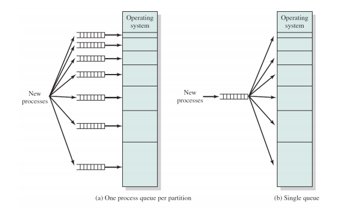
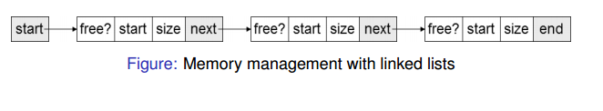
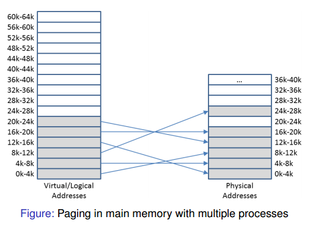
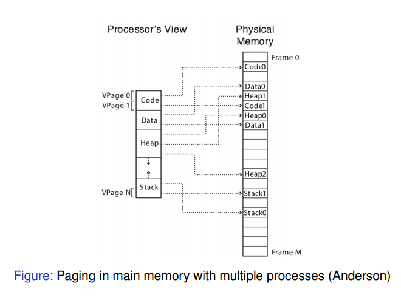
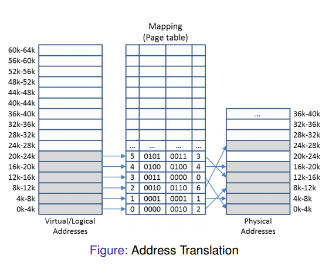
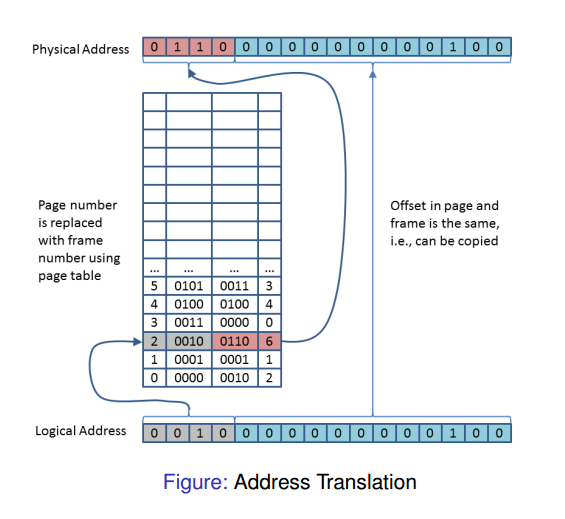

## Lecture 13: Memory Management

This lecture contains:

- Introduction to memory management
- **Modelling** of multi-programming
- Memory management based on **fixed partitioning** 

### Memory Hierarchies

The lecturer expresses often that he likes to think of a machine's memory as a linear array of memory. You can think of all memory as being stored on this array. This is an abstract way of thinking about it but can help understanding. There are several different types of computer memory, and these can be arranged into a hierarchy. This hierarchy and the reasons behind it influence how memory is managed in a system. Here is a detailed view of the hierarchy (don't need to memorise).


- **Registers** and **cache** - These are fast because they are located close to the CPU. There are sub-levels of cache memory called L1, L2, L3. These have slightly increasing speeds.
- Main memory - This is basically **RAM**. Main memory isn't as fast because it takes a significant time for the CPU to access it. This time period is known as latency. 
- **Disks** - Includes things like Hard Drives. Used for important information. Is much *cheaper* than other types.

The operating system's job is to provide a memory abstraction. But how does it do this?

### OS Responsibilities

- The OS needs to **allocate** memory, and then keep track of whether or not the memory is being used. If it is not being used, it must **deallocate** this memory. 
- It needs to *control access* when multiprogramming is applied. In other words it needs to prioritise certain tasks.
- It needs to be able to transparently move data from memory to disk and vice versa.

### Memory models

There are two models which approach memory allocation in different ways. They are:

1. **Contiguous** memory management models
2. **Non-contiguous** memory management models

The easiest way to understand this is through a graphical example:


As you can see, the *contiguous* process is unchanged when stored in memory, whereas the *non-contiguous* memory is stored in segments (think linked-lists).

### Contiguous Approaches

#### Mono-programming

Mono-programming is when there is one single partition for all user processes. For Mono-programming, a fixed region of memory is allocated to the OS/kernel, and the rest is reserved for a single user process. The OS can be thought of as another process, and so you can think of it as two processes. Just remember there is only one *user* process. This is how MS-DOS worked. Here is a graphical example for how the memory is split:


- This used contiguous memory allocation. Since there are no other processes, there is no use splitting up the memory and using a non-contiguous approach. Remember that only one process is being fulfilled at any time.
- This one process is therefore allocated across the entire memory space, and this process is always located in the same address space. This is why there is no *address translation*
- The implementation is very simple, since the memory location is always known. No protection between different processes is required.
- You can use **overlays** to enable the programmer to use more memory than available. Basically need to hack the program (probably don't need to know about this but just know it used to be OP).

There are however, several disadvantages of this approach, some of which may be obvious.

- As mentioned earlier, there is one block of memory, with some being given to the OS, and the rest being used for a user process. This sharing could cause problems. The user process could have direct access to the physical memory, and if something screws up it could end up having access to the OS memory. 
- You can't multitask and so this approach is very outdated.
- There is low utilisation of hardware resources such as CPU, I/O devices- this can make processes slow.

Despite its limitations, the ease of memory access means that some modern appliances still use mono-programming. An example is a washing machine, where multiple processes aren't desirable (maybe not for Japanese machines). It is kind-of possible to simulate a multi-programming environment on a mono-programming machine. This can be achieved through **swapping**. This is the process of *swapping* a process out to the disk and loading a new one. These context switches, however, can be time consuming and so aren't really worth.

#### Multi-programming

He does some maths to prove that CPU utilisation is higher on multi-programming machines, and that CPU utilisation increases as the number of processes increase. I doubt we'll get tested on this but check the lecture if you're interested.

### Partitioning

I will now go over partitioning in the context of memory allocation for multi-programming systems.

#### Fixed Partitions of Equal Size

This is when you split the main memory into *static, contiguous and equal sized partitions*(chunks). These have a fixed size and location. Any process can take any partition providing it is large enough. The actual memory allocation is simple since you don't need to worry about how much memory to give a process. The OS only has to keep track of which partitions are being used. Conceptually, this method is garbage for the following reasons: 

- You may have a small process which doesn't need much memory, using a large partition for a lot of memory. This means you could potentially waste a lot of memory. This is known as having **Overlays**.
-  If a process is too big for one of the partitions, you won't be able to run it. This is because the partitions are *static*, meaning they can't be dynamically adjusted.

#### Fixed Partitions of Non-Equal Size

This is when you would partition the memory into non-equal sized partitions instead. For example instead of having 5 partitions with 5M each, you have 5 different partitions with 3M, 4M, 5M, 6M, 7M respectively. This reduces *internal fragmentation* since you are wasting less memory. Note that the partitions are still static and fixed size. This method also has its drawbacks:

- More work needs to be done for the allocation of processes to the partitions. 
- It assumes that a program knows how much memory it needs. You could have a program that uses dynamic memory allocation and so deciding which partition to put it inside would be a pain in the ass.

The following diagram describes two ways by which the OS can allocate processes in such a partition.



- Diagram (a) shows a method where there is one process queue per partition. This means that each partition has a queue of processes that require at least that amount of memory. In other words, it is first come first served for the processes (you can probably already detect problems with this). One example would be if there were an abundance of processes that required just one partition. This means that only one partition would be busy and so memory usage would be inefficient. 

- Diagram (b) uses a single-queue. This means the computer takes each process as it comes and puts it into the smallest available partition. This partially solves the problem mentioned with for process queue (which is that you may be wasting several partitions). This method however, results in *increased internal fragrmentation*. This is because a 2M process may end up in a 6M partition if that is the smallest partition that is free.

## Lecture 14 - Memory Management

Topics covered in this lecture include:

- Code **relocation** and **protection**
- **Dynamic partitioning**
- **Swapping**
- **Managing free/occupied** memory

### Introduction to logical addresses

The lecture starts with a simple code example.

```c
#include <stdio.h>

int iVar = 0;
int main() {
    int i = 0;
    while(i < 10) {
	iVar++;
	sleep(2);
	printf("Address: %xl Value: %d \n", &iVar, iVar);
	i++;
    }
}
```
This code is simply printing the address and value of an incrementing variable. The lecturer asks if you run this program twice at the same time, whether or not the same address will be printed. The answer is yes, and it is here we are introduced to the concept of **logical addresses**. The **logical address** is basically the address given to the item at compile time, i.e. when the program is executed. This logical address may be different from the **physical address** which can be due to the operation of an *address translator* or *mapping function*. It is the OS's job to then translate this logical address into a physical address. This physical address that the OS assigns is likely to be different every time the program is run. So if the program were to be run at the same time, there would be no confusion or interference between variables. Remember that the *logical address* is assigned at compile time, so the variable in the code above will print the same address as long as it isn't recompiled. 

### Relocation and protection principles

- Remember how I said that the OS needs to translate the logical address into physical memory? This is known as **relocation**. The *relocation* must be solved by the OS in a way that allows for processes to be run at *changing memory locations*. 

- **Protection** is what is enforced if you have two or more programs running at the same time. Linking it back to the code example, it ensures that the variables don't get stored in the same physical memory slots (its not just RNG).


This diagram can be a bit confusing so I will split it up into parts.

- Process A is the process that needs to be allocated into memory.
- That weird thing with *MMU* written inside it represents the *Memory Management Unit*. This is basically the part of the OS that converts the logical address into the physical address.
- In an array, the *Offset* is the distance from the beginning of the array.
- The top partition is dedicated to the OS/kernel.

The *Memory Management Unit* uses the *Offset* value to calculate where the nearest available memory is, and then uses this knowledge to place the process A into this partition.

They have another slide to remind us of the difference between logical and physical memory addresses. It seems important so make sure you understand it. They are two separate things. The logical address is what is seen by the process. This logical address space is then mapped onto the machines physical address space by the OS.

### Relocation and Protection Approaches

You may be wondering about *when* the **relocation** needs to occur. There are three approaches to this:

1. **Static** relocation at **compile time** - This is impractical for multi-processing systems because you don't know which partitions in main memory are free or not. It is therefore a shitty YOLO approach and so I doubt it will come up in the test.

2. **Dynamic** relocation at **load time** - This is similar to the address relocation figure shown earlier where an *offset* is added to every logical address to account for its physical location in memory. This method however, doesn't account for **swapping** (will be explained later). For this reason, the loading process will be slow if relocation is done at load time.

3. **Dynamic** relocation at **runtime** - This is the fastest method but is more difficult and requires special hardware support.

### Dynamic Runtime Relocation

In order to achieve relocation at runtime, it relies on using two *registers*. These registers are special-purpose and so are only used for these tasks. They are:

1. The **base register** - Stores the *start address* of the partition. In other words, it uses the *offset* value mentioned previously. At *runtime*, a physical address is generated by adding this base register to the logical address.

2. The **limit register** - Stores the required size of the partition. At runtime, the resulting physical address is *compared* against the value in the limit register. This acts as a form of **protection**, as it ensures that the process is getting the correct amount of memory it needs and no less.

### Dynamic Partitioning

I have no idea why it took this long for them to tell us about this. The clue is in the name. It dynamically assigns a *variable number of partitions* of which the *size* and *starting address* can change over time. The process gets allocated an exact amount of **contiguous memory** and therefore removes the problem of internal fragmentation. Reminder: contiguous memory is memory stored in one whole block and not split up. This concept is likely to come up in the exam so be sure to remember that. Note that the exact memory requirements may not be known in advance. For example the *heap and stack* can grow dynamically. This is why a good OS practice is to allocate a bit extra memory to account for programs requiring more memory without having to use dynamic partitioning right away. This is good practice since many programs end up using more memory as time goes on.

### Swapping

So sure, *dynamic partitioning* is OP. We get it...you vape. But what if a process is taking up loads of memory but isn't actually being used? For example what happens if its waiting for input/output or some shit like that? This is where **swapping** comes into play.

Swapping holds some of the processes on the **drive** and **shuttles** (fancy word for swap I think) processes between the drive and main memory when required. The reasons for swapping are include:

- Some processes only run occasionally but may still take up valuable memory.
- If you have more processes than partitions- swapping increases efficiency a lot.
- A process's memory requirements may have changed - you can use swapping as a method for re-allocating that memory.
- If the *total* amount of memory required for the process exceeds the available memory- then the OS can outplay it with swapping.

NB: Swapping IS time consuming, but still saves time overall.

### External Fragmentation

Whilst *swapping* and *dynamic partitioning* can remove the problem of *internal fragmentation*, swapping can cause a new problem called *External Fragmentation*. This when swapping a process out of memory will create "a hole". A new process may be either too large or too small for this gap that is left behind. If it is too small, memory is wasted in the form of an *unused block*. If a process is too large, the process may be unable to find a slot even if the total spare memory capacity is there. This leads to a decrease in efficiency. It IS possible to *compact* the memory to remove the holes and this is known as dynamic relocation. This is however, a very slow process and isn't worth a lot of the time.

### Allocation Structures

Man! All of this memory management shit sounds really complicated! If only there was a data structure that would allow me to not only keep track of available memory, but also provide a way to quickly allocate processes to available memory slots! No Pedro, the answer does not lie in memory.js, but instead lies in *Linked Lists*. The following image shows what such a list would look like:



There is a struct for each partition that contains a flag for whether or not it is free. It also contains data items such as the start of the memory block, and the size (same shit stored in the *base* and *limit* registers). This makes the allocation of processes to unused blocks a lot easier.

An alternative data structure we can use are **bitmaps**. First, memory is split into blocks. Do not get this confused with partitions. This is simply the bitmap representation of the physical memory. E.g. one bitmap may have 10,000 blocks with an *allocation unit* of 10kb each. A bit map is set up so that each bit is 0 if the memory block is free and 1 if the block is used. You can find a hole of a specified memory amount by finding the right number of adjacent bits set to 0. Here is a good bitmap representation I found:


In this minimalistic example, the bitmap is split into 40 blocks. This is a representation of the whole physical memory in fixed sized blocks. This concept wasn't clear to me initially hence the repetition.

Bitmaps have advantages and disadvantages. Disadvantages include:

- If the bitmap *allocation units* (blocks) are a small amount of memory, it means that the overall bitmap is going to be large (will contain more 1's and 0's). This can potentially make bitmaps very slow to process. 

- Now consider the other scenario where the *allocation unit* is a large amount of memory. This can cause *internal fragmentation* because the bitmap may declare memory to be used which isn't actually being used 

- Since linked lists can link *free* nodes together, it is therefore faster to find a free *block* (hole) with linked lists

It is these disadvantages why bitmaps are much less common than linked lists in this context.

In terms of advantages, the actual process of filling the hole is easier and faster with bitmaps because you just need to change the corresponding values from 0 to 1. Also I'm pretty sure bitmaps take up less space. The lecturer said that the advantages and disadvantages of linked lists/ bitmaps could come up in the test which is why I did some extra research on it. So make sure you understand the key differences.

## Lecture 15 - Memory Management

The goals for this lecture are:

- **Dynamic partitioning management** with Linked lists
- **Non-contiguous approaches**
- **Paging**, page tables, address translation

### Allocating Available Memory - Algorithms

#### First Fit Algorithm

1. Starts at the head of the linked list and iterates along it until a link is found that has sufficient free space for the process
2. If the requested space is the same as the amount of free space in this partition, all the space is allocated
3. Else, the free link is split into two- the first node is set to the size requested and marked "used" whilst the second is set to the remaining size and marked "free"

#### Next Fit Algorithm

1. Same as **first-fit** except stores where in the linked lists it stops, and then restarts the search from here after
2. Gives an even chance to all memory to get allocated while first fit concentrates on the start of the list. Remember the linear array analogy, imagine repeatedly starting from the bottom to find free space.

Simulations have shown that *next fit* actually gives a worse performance than *first fit*.

#### Problems with First/Next Fit

These methods are both very fast due to their YOLO nature, but this can also lead to some disadvantages. For example, first fit is only looking for the first available hole/gap. Once it finds it, it doesn't give two fucks whether or not there is a more suitable free partition later on. By then its already called "gg ez". This is problem because there could potentially be a free partition later on which fits the process exactly. In this scenario, the algorithm is unneccessarily breaking up a big hole, which brings more problems. Next fit doesn't improve much on this front; and so we have to look at other potential algorithms.

#### Best Fit

- The **best fit** algorithm will always search the entire linked list in order to find the smallest suitable hole for the memory request. As you can imagine, this is a lot slower than first/next fit. 
- Best fit is the same as first/next fit in the respect that there is no guarantee that a partition with the exact right amount of memory will exist. It uses the same splitting method to solve this problem. However, since best fit finds the smallest hole to split, there could be a lot of very small holes generated. These are useless bits of memory that barely any processes will be able to use. 

Note that it IS possible to merge free partitions that are next to each other and this is called **Coalescing** (more on that in a bit).

#### Worst fit

- Worst fit finds the largest available empty partition/hole and splits it. The idea being that there won't be any useless holes being left behind like there are with *best fit*. The holes will instead be large and probably more useful.
- However in reality, this algorithm sucks ass too.

He mentions in the lecture that a typical question in an exam would be to list the advantages and disadvantages of these methods. So make sure you understand them!

#### Quick Fit


- Maintains separate lists for commonly used sizes. For example could have lists for partitions of sizes 4k, 8k, 12k and so on.
- This is a lot faster than *best fit* at finding a required sized partition.
- Has same problem as *best fit* in that it can create tiny, useless partitions.
- *Coalescing* (merging free spaces) is difficult due to the fact that it uses multiple lists. 

### Managing Available Memory

#### Coalescing

Takes place when two *adjacent entries* in the linked list become free. When a block is freed, both neighbours are examined. Two or three entries are then combined into a larger block by adding up the sizes. The excess node(s) are deleted and the length/amount of memory for the node that was originally first is updated.

#### Compacting

As you can imagine, *coalescing* can only take you so far. If it gets to the point where lots of free blocks are being sandwiched by used blocks, and are distributed across memory, then we must use **compacting**. Obviously, this is a pretty time-consuming process - more so than coalescing. It is a three step process:
1. Process is swapped out
2. Free space is coalesced
3. Process swapped back in at lowest available location

This part of the lectured marked the end of the study of *contiguous* allocation schemes. Reminder that this is when processes are NOT split up to be stored in memory, but left as they are. The problems of such schemes are highlighted here. These include *internal fragmentation* from fixed-partitioning, as well as *external fragmentation* (wasted free holes) from dynamic partitioning.

### Paging

#### What is Paging?

Paging is based on the principles of *fixed partitioning* and *code re-location*. Code relocation is the process of translating from logical/virtual memory to physical memory. Paging works by splitting memory into smaller blocks. One or more blocks are allocated to a process. For example, a 11KB process could take up 3 blocks of 4 KB. Internal fragmentation (excess, wasted memory) is reduced since there can only be excess memory wasted for the last block. There is also no external fragmentation since blocks are stacked directly onto each other in main memory (one of the main reasons for using a non-contiguous approach). Here is a graphical representation of paging:



Each grey block represents one page. The fact that the data is split isn't a huge problem, because it can be split logically like so:




As you can see, the process is already split up into different parts e.g. stack, heap, code. Therefore you with paging you can split up these processes further and it isn't that hard to follow. Note that you still need to allocate some extra memory for growth.

So we can say that a **page** is simply a small block of *contiguous* memory in the *logical* address space. But when we're talking about this block in the context of *physical* memory, then we call it a **frame**. Pages and frames usually have the same size, which is usually a power of 2. Fun fact: sizes range between 512 bytes and 1Gb.

#### Page Tables

Now that the definitions are clear, I'll explain how the OS knows which page went where. This is essential for knowing the correct order of the process in main memory...obviously. You might have guessed that the best way to do this is with some sort of mapping, and you would be correct. First, the information about each logical page needs its own **base register** that specifies the start of the associated frame. This is similar to the base registers mentioned previously. Note that no *limit registers* are needed because each page is a fixed partition size. So we now know that each page has a *base register* which means that a process will have a *set* of base registers that needs to be stored and maintained. They are stored in what is called a **page table**. This is what it looks like:



The page table is basically a form of *mapping*. It basically keeps track of the index of the pages. In the lecture he describes the page table as a 'function that maps the page number of the logical address onto the frame number of the physical address'.

frameNumber = f(pageNumber)

#### Logical Addresses

Every process has its own page table, which contains its own base registers. Each page has a *logical address* that helps with the address translation. This *logical address* contains two two things:

1. The offset within the page. This is represented by the right most n bits. Remember that everything is a power of two. So if there are 12 bits for the offset, this means there are 2^12 bytes per page.

2. The left most n bits represent the page number. It is represented like so.

It is possible calculate the offset and page number from an address. Not sure if we learn how to do that or not...I hope not. Here is an image of all this shit in action yay!



At the bottom is the logical address mentioned earlier. Note that since the offsets for both the page and frame are usually the same, the right most bits can be left the same. The page table contains the information for how the page number is translated to the frame number. 

In summary, processes contain **bage tables** that contain **base registers** that contain **logical addresses** that contain information on what the page number is and its offset.

1. Page number is extracted using logical address
2. Frame number for that page number is retrieved in page table
3. Offset is added to the start of the physical frame to allocate the correct amount of memory

In terms of hardware implementation of address translation, the CPU's **Memory Management Unit** (MMU) intercepts logical addresses and uses a page table. It then stores the physical address on a **memory bus**.

## Lecture 16 - Memory Management

Turns out we do have to know how to calculate address translations.

Topics covered in this lecture are:

- Examples of Address Translation (math shit)
- Principles behind **virtual memory**
- Complex/ large page tables


