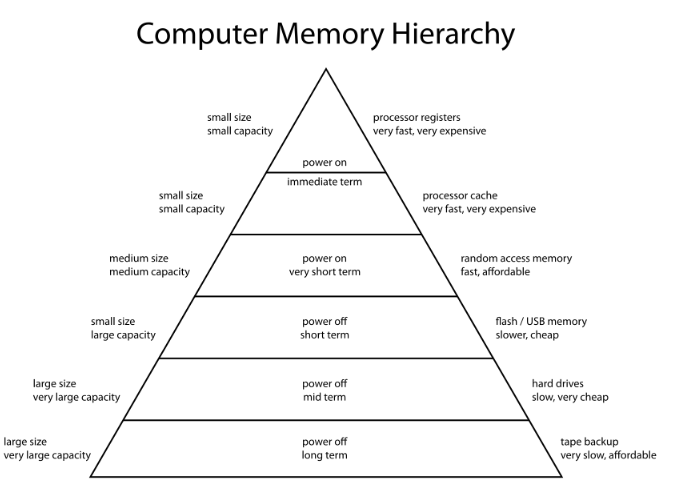
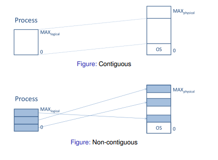
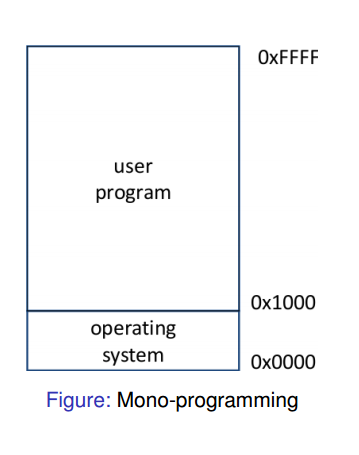
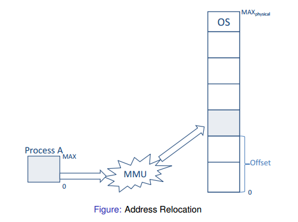

## Lecture 13: Memory Management

This lecture contains:

- Introduction to memory management
- **Modelling** of multi-programming
- Memory management based on **fixed partitioning** 

### Memory Hierarchies

The lecturer expresses often that he likes to think of a machine's memory as a linear array of memory. You can think of all memory as being stored on this array. This is an abstract way of thinking about it but can help understanding. There are several different types of computer memory, and these can be arranged into a hierarchy. This hierarchy and the reasons behind it influence how memory is managed in a system. Here is a detailed view of the hierarchy (don't need to memorise).



- **Registers** and **cache** - These are fast because they are located close to the CPU. There are sub-levels of cache memory called L1, L2, L3. These have slightly increasing speeds.
- Main memory - This is basically **RAM**. Main memory isn't as fast because it takes a significant time for the CPU to access it. This time period is known as latency. 
- **Disks** - Includes things like Hard Drives. Used for important information. Is much *cheaper* than other types.

The operating system's job is to provide a memory abstraction. But how does it do this?

### OS Responsibilities

- The OS needs to **allocate** memory, and then keep track of whether or not the memory is being used. If it is not being used, it must **deallocate** this memory. 
- It needs to *control access* when multiprogramming is applied. In other words it needs to prioritise certain tasks.
- It needs to be able to transparently move data from memory to disk and vice versa.

### Memory models

There are two models which approach memory allocation in different ways. They are:

1. **Contiguous** memory management models
2. **Non-contiguous** memory management models

The easiest way to understand this is through a graphical example:



As you can see, the *contiguous* process is unchanged when stored in memory, whereas the *non-contiguous* memory is stored in segments (think linked-lists).

### Contiguous Approaches

#### Mono-programming

Mono-programming is when there is one single partition for all user processes. For Mono-programming, a fixed region of memory is allocated to the OS/kernel, and the rest is reserved for a single user process. The OS can be thought of as another process, and so you can think of it as two processes. Just remember there is only one *user* process. This is how MS-DOS worked. Here is a graphical example for how the memory is split:




- This used contiguous memory allocation. Since there are no other processes, there is no use splitting up the memory and using a non-contiguous approach. Remember that only one process is being fulfilled at any time.
- This one process is therefore allocated across the entire memory space, and this process is always located in the same address space. This is why there is no *address translation*
- The implementation is very simple, since the memory location is always known. No protection between different processes is required.
- You can use **overlays** to enable the programmer to use more memory than available. Basically need to hack the program (probably don't need to know about this but just know it used to be OP).

There are however, several disadvantages of this approach, some of which may be obvious.

- As mentioned earlier, there is one block of memory, with some being given to the OS, and the rest being used for a user process. This sharing could cause problems. The user process could have direct access to the physical memory, and if something screws up it could end up having access to the OS memory. 
- You can't multitask and so this approach is very outdated.
- There is low utilisation of hardware resources such as CPU, I/O devices- this can make processes slow.

Despite its limitations, the ease of memory access means that some modern appliances still use mono-programming. An example is a washing machine, where multiple processes aren't desirable (maybe not for Japanese machines). It is kind-of possible to simulate a multi-programming environment on a mono-programming machine. This can be achieved through **swapping**. This is the process of *swapping* a process out to the disk and loading a new one. These context switches, however, can be time consuming and so aren't really worth.

#### Multi-programming

He does some maths to prove that CPU utilisation is higher on multi-programming machines, and that CPU utilisation increases as the number of processes increase. I doubt we'll get tested on this but check the lecture if you're interested.

### Partitioning

I will now go over partitioning in the context of memory allocation for multi-programming systems.

#### Fixed Partitions of Equal Size

This is when you split the main memory into *static, contiguous and equal sized partitions*(chunks). These have a fixed size and location. Any process can take any partition providing it is large enough. The actual memory allocation is simple since you don't need to worry about how much memory to give a process. The OS only has to keep track of which partitions are being used. Conceptually, this method is garbage for the following reasons: 

- You may have a small process which doesn't need much memory, using a large partition for a lot of memory. This means you could potentially waste a lot of memory. This is known as having **Overlays**.
-  If a process is too big for one of the partitions, you won't be able to run it. This is because the partitions are *static*, meaning they can't be dynamically adjusted.

#### Fixed Partitions of Non-Equal Size

This is when you would partition the memory into non-equal sized partitions instead. For example instead of having 5 partitions with 5M each, you have 5 different partitions with 3M, 4M, 5M, 6M, 7M respectively. This reduces *internal fragmentation* since you are wasting less memory. Note that the partitions are still static and fixed size. This method also has its drawbacks:

- More work needs to be done for the allocation of processes to the partitions. 
- It assumes that a program knows how much memory it needs. You could have a program that uses dynamic memory allocation and so deciding which partition to put it inside would be a pain in the ass.

The following diagram describes two ways by which the OS can allocate processes in such a partition.


- Diagram (a) shows a method where there is one process queue per partition. This means that each partition has a queue of processes that require at least that amount of memory. In other words, it is first come first served for the processes (you can probably already detect problems with this). One example would be if there were an abundance of processes that required just one partition. This means that only one partition would be busy and so memory usage would be inefficient. 

- Diagram (b) uses a single-queue. This means the computer takes each process as it comes and puts it into the smallest available partition. This partially solves the problem mentioned with for process queue (which is that you may be wasting several partitions). This method however, results in *increased internal fragrmentation*. This is because a 2M process may end up in a 6M partition if that is the smallest partition that is free.

## Lecture 14 - Memory Management

Topics covered in this lecture include:

- Code **relocation** and **protection**
- **Dynamic partitioning**
- **Swapping**
- **Managing free/occupied** memory

### Code Relocation and Protection

#### Introduction to logical addresses

The lecture starts with a simple code example.

```c
#include <stdio.h>

int iVar = 0;
int main() {
    int i = 0;
    while(i < 10) {
	iVar++;
	sleep(2);
	printf("Address: %xl Value: %d \n", &iVar, iVar);
	i++;
    }
}
```
This code is simply printing the address and value of an incrementing variable. The lecturer asks if you run this program twice at the same time, whether or not the same address will be printed. The answer is yes, and it is here we are introduced to the concept of **logical addresses**. The **logical address** is basically the address given to the item at compile time, i.e. when the program is executed. This logical address may be different from the **physical address** which can be due to the operation of an *address translator* or *mapping function*. It is the OS's job to then translate this logical address into a physical address. This physical address that the OS assigns is likely to be different every time the program is run. So if the program were to be run at the same time, there would be no confusion or interference between variables. Remember that the *logical address* is assigned at compile time, so the variable in the code above will print the same address as long as it isn't recompiled. 

####Relocation and protection principles

- Remember how I said that the OS needs to translate the logical address into physical memory? This is known as **relocation**. The *relocation* must be solved by the OS in a way that allows for processes to be run at *changing memory locations*. 

- **Protection** is what is enforced if you have two or more programs running at the same time. Linking it back to the code example, it ensures that the variables don't get stored in the same physical memory slots (its not just RNG).



This diagram can be a bit confusing so I will split it up into parts.

- Process A is the process that needs to be allocated into memory.
- That weird thing with *MMU* written inside it represents the *Memory Management Unit*. This is basically the part of the OS that converts the logical address into the physical address.
- In an array, the *Offset* is the distance from the beginning of the array.
- The top partition is dedicated to the OS/kernel.

The *Memory Management Unit* uses the *Offset* value to calculate where the nearest available memory is, and then uses this knowledge to place the process A into this partition.

They have another slide to remind us of the difference between logical and physical memory addresses. It seems important so make sure you understand it. They are two separate things. The logical address is what is seen by the process. This logical address space is then mapped onto the machines physical address space by the OS.

###Relocation and Protection Approaches

You may be wondering about *when* the **relocation** needs to occur. There are three approaches to this:

1. **Static** relocation at **compile time** - This is impractical for multi-processing systems because you don't know which partitions in main memory are free or not. It is therefore a shitty YOLO approach and so I doubt it will come up in the test.

2. **Dynamic** relocation at **load time** - This is similar to the address relocation figure shown earlier where an *offset* is added to every logical address to account for its physical location in memory. This method however, doesn't account for **swapping** (will be explained later). For this reason, the loading process will be slow if relocation is done at load time.

3. **Dynamic** relocation at **runtime** - This is the fastest method but is more difficult and requires special hardware support.

#### Dynamic Runtime Relocation

In order to achieve relocation at runtime, it relies on using two *registers*. These registers are special-purpose and so are only used for these tasks. They are:

1. The **base register** - Stores the *start address* of the partition. In other words, it uses the *offset* value mentioned previously. At *runtime*, a physical address is generated based on the value stored in the base register.

2. The **limit register** - Stores the required size of the partition. At runtime, the resulting physical address is *compared* against the value in the limit register. This acts as a form of protection, as it ensures that the process is getting the correct amount of memory it needs and no less.


